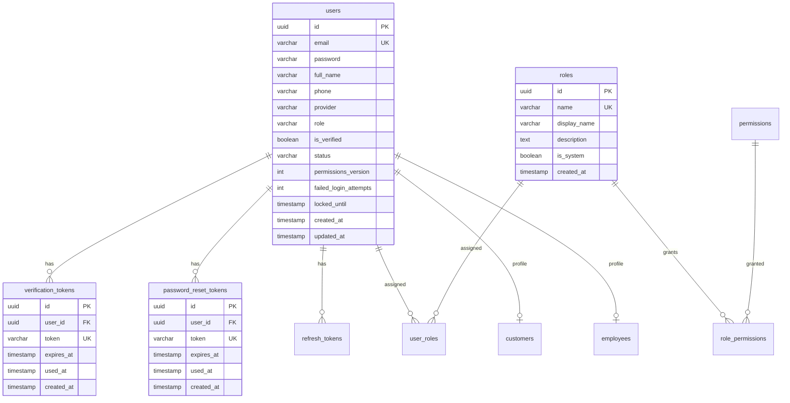

# Authentication & RBAC Design

## Project Analysis

- Backend: Spring Boot 3.4.5, Java 21, Spring Web, Spring Security, Spring Data JPA, Validation, OAuth2 Client, Mail, Flyway, PostgreSQL, JWT (`jjwt`).
- Frontend: React + Vite, React Router, Axios, page modules for guest/auth/customer/admin/staff-style dashboards.
- Database: PostgreSQL/Supabase-compatible schema managed by Flyway migrations in `backend/src/main/resources/db/migration`.
- Security: stateless Spring Security with JWT bearer/cookie parsing, bcrypt password hashing, method security via `@PreAuthorize`, REST 401/403 handlers, OAuth2 Google login, CORS config, token revocation tables.
- Sensitive config must come from environment variables: `DB_URL`, `DB_USERNAME`, `DB_PASSWORD`, `MAIL_USERNAME`, `MAIL_PASSWORD`, `GOOGLE_CLIENT_ID`, `GOOGLE_CLIENT_SECRET`, `JWT_SECRET`.

## ERD Scope

`verification_tokens` and `password_reset_tokens` are the project's concrete OTP token tables. Both store 6-digit OTP values, expire after `app.otp-expiration-minutes` (default 5), and are single-use.

## Roles

- `ADMIN`: full system control, including users, roles, permissions, service/resource CRUD, and reports.
- `STAFF`: operational permissions such as appointment handling, customer lookup, invoice creation, and service reads/updates allowed by assigned permissions. Staff cannot manage roles or permissions.
- `CUSTOMER`: own-data permissions only, such as reading/updating `/api/users/me`, creating own appointments, and reading own invoices.

The database can hold additional system roles, but these three are the required baseline roles for the current module.

## API Design

| Method | Endpoint | Auth | Purpose |
| --- | --- | --- | --- |
| `POST` | `/api/auth/register` | Public | Create inactive local customer account and email a 6-digit verification OTP. |
| `POST` | `/api/auth/verify-otp` | Public | Verify email OTP; when valid and not expired, set user `ACTIVE` and `is_verified=true`. |
| `POST` | `/api/auth/resend-verification` | Public | Send a new verification OTP for an unverified local account. |
| `POST` | `/api/auth/login` | Public | Login active local account, enforce failed-password lockout, return JWT access/refresh token and profile. |
| `POST` | `/api/auth/refresh` | Public | Rotate refresh token and issue a new token pair. |
| `POST` | `/api/auth/logout` | Public | Revoke access and/or refresh tokens. |
| `POST` | `/api/auth/forgot-password` | Public | Send password-reset OTP to active local account. |
| `POST` | `/api/auth/verify-reset-otp` | Public | Validate password-reset OTP before allowing the reset UI to continue. |
| `POST` | `/api/auth/reset-password` | Public | Validate password-reset OTP, bcrypt-hash new password, revoke refresh tokens. |
| `POST` | `/api/auth/change-password` | Authenticated | Change current local user's password. |
| `GET` | `/api/users/me` | Authenticated | Read current user's own profile. |
| `PUT` | `/api/users/me` | Authenticated | Update current user's own profile. |
| `PUT` | `/api/users/avatar` | Authenticated | Update current user's own avatar. |
| `GET/POST/PUT/DELETE` | `/api/admin/roles/**` | `ADMIN` | Manage roles and role permissions. |
| `GET/POST/DELETE` | `/api/admin/permissions/**` | `ADMIN` | Manage permissions. |
| `GET/POST/DELETE` | `/api/admin/users/{userId}/roles/**` | `ADMIN` | Assign/revoke user roles. |

## Server-Side Enforcement

- 401 Unauthorized: unauthenticated requests are handled by `RestAuthenticationEntryPoint`.
- 403 Forbidden: authenticated users without required role/permission are handled by `RestAccessDeniedHandler`.
- Admin APIs are blocked by both `SecurityConfig` (`/api/admin/**` requires `ROLE_ADMIN`) and controller-level `@PreAuthorize("hasRole('ADMIN')")`.
- Customer own-data APIs use `/api/users/me`, so callers cannot pass another customer's user id.
- JWT includes `perm_ver`; role changes increment `users.permissions_version` so authorities are reloaded when permissions change.
- Login rate limiting: 5 failed password attempts lock the account for 15 minutes via `users.failed_login_attempts` and `users.locked_until`.
